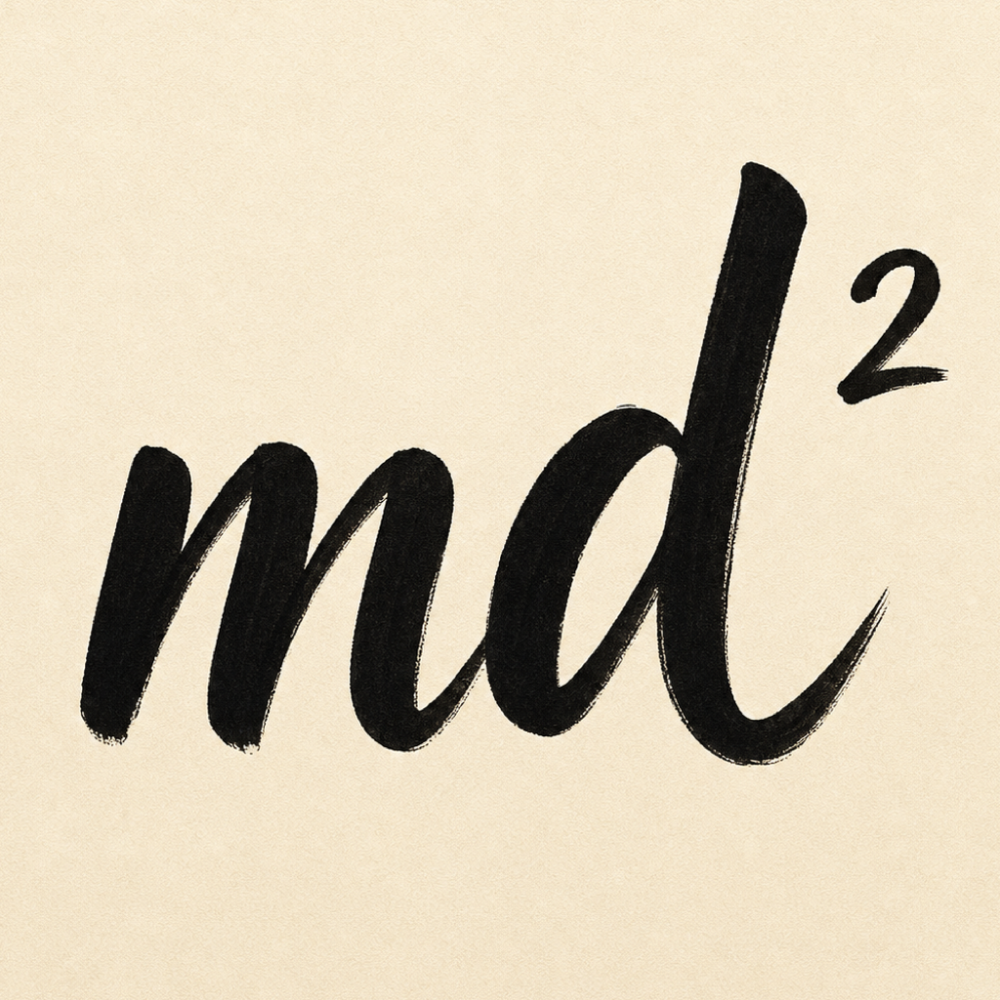
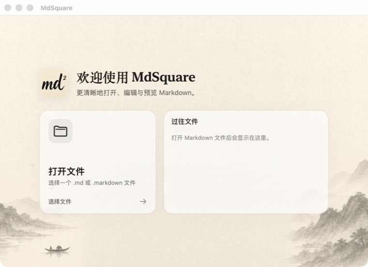

# MdSquare

<p align="center">
  
</p>

<p align="center">
  面向 macOS 的本地 Markdown 编辑器。<br>
  A local-first Markdown editor for macOS.
</p>




## 功能

- 原生 macOS 文档应用，支持打开和保存 `.md`、`.markdown` 文件。
- 大纲、编辑器、实时预览三栏布局，以及写作、阅读、专注三种精简模式。
- ATX/Setext 标题提取、重复标题 slug 去重和大纲跳转。
- 加粗、斜体、链接、列表、引用、代码块和安全文字颜色命令。
- 原生查找、撤销、快捷键、文档统计和窗口状态记忆。
- 未保存草稿恢复，以及源文件被删除或外部修改时的提示。
- 本地同目录图片预览；远程图片、脚本和不安全链接默认阻止。
- 针对 100KB 和 1MB Markdown 文档的自动化性能检查。

## 系统要求

- macOS 14 或更高版本
- Swift 6 工具链
- Node.js 20.19 或更高版本与 npm（CI 使用 Node.js 24；用于预览依赖、fixture 和性能验证）

## 本地构建

```bash
npm ci
./script/build_and_run.sh
```

构建脚本会在 `dist/MdSquare.app` 生成本地应用并启动它。该应用仅用于本地开发，没有正式签名或公证。

## 测试

```bash
npm ci
./script/test.sh
node script/measure_core_perf.mjs --budget
npm audit --package-lock-only --audit-level=moderate
```

测试覆盖文档读写、标题解析、编辑命令、预览安全、草稿恢复、外部文件状态、布局计算和性能边界。手工验收项目见 [docs/qa/manual-mvp-checklist.md](docs/qa/manual-mvp-checklist.md)。

## 架构

应用使用 SwiftUI 组织界面，使用 AppKit 承载原生文本编辑和窗口能力，使用受限的 WebKit 预览层渲染 Markdown。主要数据流和安全边界见 [docs/design/architecture.md](docs/design/architecture.md)。

Swift Package 中的可执行产品名为 `MdSquare`，内部源码 target 保留历史名称 `MarkdownDev`。

## 预览安全边界

- 原始 HTML 默认保持惰性，不直接注入预览 DOM。
- `javascript:`、`file:` 等不安全链接不会跳转。
- 远程图片不会请求；符合大小限制的同目录本地 PNG/JPEG/GIF 可转换为 data URL。
- 只有明确允许的红色和蓝色文字标记会作为安全样式渲染。

这些边界有自动化测试，但不构成对任意恶意文件的绝对安全保证。安全问题请参阅 [SECURITY.md](SECURITY.md)。

## 项目状态

- 自动化测试和预览性能预算已通过。
- 部分真实 App 手工验收仍明确标记为待执行。
- 当前没有签名、公证、DMG 或 GitHub Release。
- 当前构建产物不会提交到源码仓库。

## 第三方组件

Markdown 预览使用 `markdown-it`，测试工具使用 `linkedom`。许可文本见 [THIRD_PARTY_NOTICES.md](THIRD_PARTY_NOTICES.md)。

## License

MIT.
